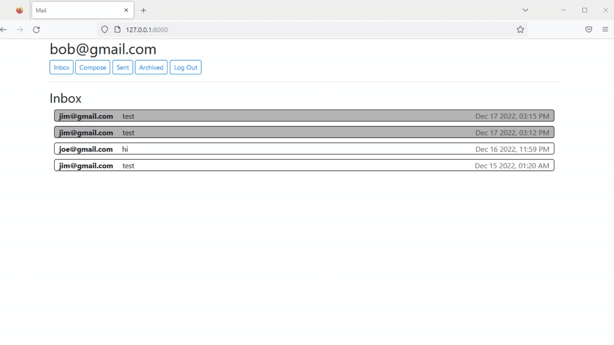

## Mail
A single-page front-end for an email client that makes API calls to send and receive emails. Created using JavaScript, HTML, and CSS. Allows users to send and receive emails, check their mailbox, archive and unarchive emails, and reply to emails.

## How To Use
To clone and run this application, you'll need [Git](https://git-scm.com/), [Python](https://www.python.org/), and [Django](https://www.djangoproject.com/). 
```
# Clone this repository
git clone --depth 1 --filter=blob:none --sparse https://github.com/JohnZolton/CS50-Web

# Go into the repository
cd CS50-Web

# check out Mail
git sparse-checkout set Mail

# Go into the directory
cd Mail/mail

# Install dependencies
pip install -r requirements.txt

# Run the app
python manage.py runserver
```
